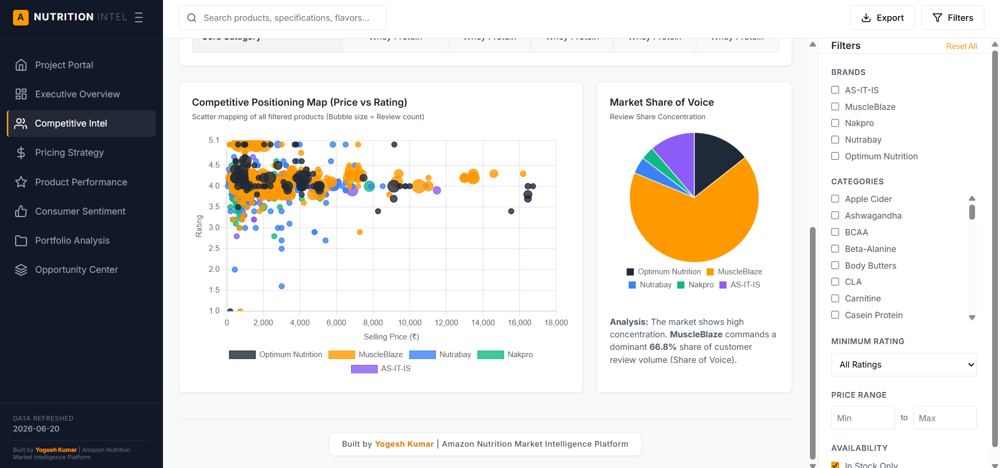

# Sports Nutrition Market Intelligence Dashboard

A comprehensive market intelligence platform for analyzing the sports nutrition supplement market on Amazon India. Combines data scraping, ETL pipelines, and interactive BI dashboards to deliver competitive insights.

## Overview

This project aggregates and analyzes the Amazon India sports nutrition segment, capturing product data, customer reviews, pricing strategies, and market positioning. The result is a Power BI dashboard that tracks competitive dynamics in real-time.

**Market Coverage**: 910+ products | **5 Major Brands** | **1.19M+ Reviews** | **8 Product Categories**

### 🌟 Project Preview




---

## URL https://nutrition-intel-6mokb8tve-exio5459m.vercel.app/

---

## Project Architecture

```
Raw Amazon Data
       ↓
  [Apify Scraper]
       ↓
   JSON/CSV Files
       ↓
  [SQL Cleaning]
       ↓
 [Power Query ETL]
       ↓
  Structured Data
       ↓
 [Power BI Dashboard]
       ↓
 Interactive Insights
```

## What's Included

### 1. Data Collection (`/scraping`)
- **Tool**: Apify (cloud-based web scraping)
- **Scope**: Amazon.in product listings, specifications, pricing, reviews
- **Frequency**: Monthly refreshes
- **Output**: Structured JSON/CSV datasets

**Key Data Points Captured**:
- Product ASIN, title, brand, category
- Current price, original price, discount %
- Rating, total reviews, review text (sample)
- Availability status, shipping info
- Product images and specifications

### 2. Data Processing (`/data-pipeline`)

#### SQL Transformations
```sql
-- Example: Normalize pricing and calculate metrics
SELECT 
  asin,
  product_name,
  brand,
  current_price,
  ROUND((1 - current_price/original_price) * 100, 2) as discount_pct,
  rating,
  review_count,
  CASE 
    WHEN current_price < 1500 THEN 'Budget'
    WHEN current_price < 3000 THEN 'Mid-Range'
    ELSE 'Premium'
  END as price_segment
FROM raw_products
WHERE category IN ('Whey Protein', 'Creatine', 'Pre-Workout', 'BCAA')
ORDER BY review_count DESC;
```

#### Power Query Pipeline
- Remove duplicates based on ASIN
- Handle missing values (use category averages)
- Standardize brand names (spelling variations)
- Calculate derived metrics (value score, sentiment index)
- Create date dimension for time-series analysis
- Generate category hierarchies

### 3. Analytics & Insights (`/analytics`)

The Power BI dashboard provides:

**Market Overview**
- Total products, brands, reviews, average rating
- Market leader identification
- Category distribution and penetration

**Competitive Positioning**
- Price vs. Rating scatter plot (bubble size = review count)
- Brand market share (by review volume)
- Price tier distribution by brand
- Discount strategy analysis

**Performance Metrics**
- Brand satisfaction ledger (rating + sentiment)
- Positive/negative sentiment percentage
- Review frequency by rating level
- BSR (Best Seller Rank) correlation analysis

**Category Analysis**
- Product count by category
- Form factor distribution (powder, capsule, tablet)
- Category-level pricing benchmarks
- Growth opportunity whitespace detection

## Key Findings

### Market Concentration
- **Market Leader**: MuscleBlaze (332 products, 840K+ reviews, 66.8% share of voice)
- **#2 Player**: Nutrabay (256 products, 320K+ reviews)
- **Emerging Challenge**: Nakpro (aggressive discounting at 39% avg, 119 products)

### Pricing Landscape
- **Premium Tier** (₹3000+): Optimum Nutrition (₹3,387 avg) - 9.2% avg discount
- **Mid-Range** (₹1500-3000): MuscleBlaze (₹2,560 avg) - 14.7% avg discount, highest volume
- **Budget** (<₹1500): Nakpro (₹1,406 avg) - 39% avg discount, value play

### Category Insights
- Whey Protein dominates (300+ products, 650K+ reviews)
- BCAA, Creatine, and Pre-Workout form the core 4
- Hidden gems in specialized categories (plant proteins, joint support) with <5 competitors

### Customer Sentiment
- **High Satisfaction Brands**: AS-IT-IS (4.41/5), Optimum Nutrition (4.20/5)
- **Review Velocity**: MuscleBlaze generates ~840K reviews vs. Nakpro's 42K
- **Sentiment Variance**: Brands with >80% positive sentiment outperform on repurchase

## Dashboard Features

### Interactive Filters
- Brand selection (multi-select)
- Price range slider
- Category/subcategory drill-down
- Rating minimum threshold
- Availability status

### Dynamic Calculations
- Real-time market share by multiple dimensions
- Competitive positioning scores
- Price elasticity estimation
- Value index (rating per rupee)

### Export Capabilities
- Dashboard snapshots (PNG/PDF)
- Raw data export for custom analysis
- Scheduled email reports

## Technical Stack

| Component | Technology |
|-----------|------------|
| Data Scraping | Apify (Node.js based) |
| Data Storage | Cloud JSON datastores |
| Transformation | SQL + Power Query (M language) |
| BI & Visualization | Power BI Desktop/Service |
| Version Control | Git + GitHub |
| Refresh Schedule | Monthly automated runs |

## How to Use This Project

### For Analysts
1. Open the Power BI dashboard
2. Use filters to segment by brand/category/price
3. Export relevant visuals for reports
4. Drill into "Details" view for product-level data

### For Engineers
1. Review the SQL scripts in `/data-pipeline/sql/`
2. Check Power Query transformations in `/data-pipeline/power-query/`
3. Understand data lineage and quality checks
4. Modify scraping parameters in `/scraping/config.json`

### For Product Teams
1. Use the "Market Niches & Whitespace" module to find gaps
2. Analyze competitor pricing in "Pricing & Position Strategy"
3. Monitor brand sentiment in "Consumer Sentiment & Brand Trust"
4. Track category momentum over time

## Data Quality & Validation

- **Deduplication**: Matched on ASIN + brand to eliminate duplicates
- **Outlier Detection**: Flagged prices >3 standard deviations from category mean
- **Completeness Checks**: Products missing critical fields (price, rating) are excluded
- **Freshness Monitoring**: Alerts if data is >45 days old
- **Referential Integrity**: All foreign keys validated

## Limitations & Considerations

- Data reflects Amazon.in only (not other channels like Flipkart, direct)
- Reviews are point-in-time snapshot (historical sentiment not tracked)
- Pricing is daily snapshot (doesn't capture intra-day changes)
- Review text analysis is limited to rating distribution (not NLP sentiment)
- ASIN mapping to GST categories is approximate

## Future Enhancements

- [ ] Add competitor scraping (Flipkart, direct brand websites)
- [ ] Implement NLP-based sentiment analysis on review text
- [ ] Build demand forecasting model (time-series prediction)
- [ ] Add marketing campaign tracking (hashtag, influencer mentions)
- [ ] Integrate sales velocity proxy (review velocity + BSR changes)
- [ ] Create automated alerting for competitive moves

## Setup & Deployment

### Prerequisites
- Apify account with active credits
- Power BI Desktop (for development) or Power BI Service (for sharing)
- SQL knowledge (basic queries)
- 4GB+ free disk space for datasets

### Steps
```bash
# 1. Clone the repo
git clone https://github.com/[your-username]/nutrition-market-intel.git

# 2. Set up Apify actor
cd scraping
npm install
# Configure APIFY_TOKEN in .env

# 3. Run SQL transformations
# Update database connection in config
sqlcmd -S [server] -i data-pipeline/sql/main.sql

# 4. Open Power BI file
open reports/Sports_Nutrition_Dashboard.pbix

# 5. Refresh data
# In Power BI: Home > Refresh
```

## Contributing

Improvements welcome! Areas we're looking for help:

- **Better web scraping** (handling dynamic pricing, A/B tests)
- **Data quality improvements** (better deduplication logic)
- **New visualizations** (customer journey mapping, RFM analysis)
- **Performance optimization** (faster query execution)
- **Documentation** (adding more examples, tutorials)

## Author

**Built by**: Yogesh Kumar  
**Last Updated**: June 2026  
**Update Frequency**: Monthly

## License

This project is for educational and authorized business use only. Web scraping of Amazon follows their terms of service. Commercial use should verify compliance.

## Contact & Questions

Have questions about methodology or want to discuss the insights? Reach out via:
- LinkedIn: https://www.linkedin.com/in/yogesh-kumar-30b044143/
- Email: yogeshkumar7651@gmail.com

---

**Note**: This is a real-world market analysis project built with actual tools and real constraints. The dashboards in this repo are anonymized versions; contact me for access to live/updated versions.
